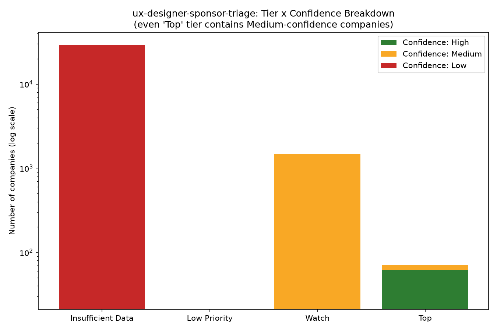

# The Reallocation Engine, Audited — ux-designer-sponsor-triage
**Author:** Yuqing Huang
**Course:** INFO 7375 — Computational Skepticism for AI
**Domain:** Access/Eligibility — H-1B Sponsorship Triage for Product/UX Designers
**Engine layer anchor:** "80 Days to Stay" — the SEC Form D + H-1B sponsorship-history join described in **Chapter 6 ("Where the Money Went: SEC Form D")** and **Chapter 7 ("Who Sponsors: The 80 Days Sponsorship Scorer")** of *The Reallocation Engine* (Brown & Humanitarians AI, 2026). The Hard-Stop Gate's liveness check (Component 7) additionally anchors to **Chapter 8 ("Is the Job Real: ATS Detection and Liveness")**. 

---
# Worked Run — The Working Reallocation Tool (Audited)

## Objective (one plain sentence)
Rank companies by estimated likelihood of sponsoring a Product/UX Designer
H-1B, using historical design-title sponsorship approval rate, funding
health, and company age, so a design job-seeker can reallocate limited
application time toward companies most likely to sponsor.

**What this leaves out:** whether the company is actively hiring for a
sponsored role right now, whether it has immigration-sponsorship budget
this specific year, and whether the applicant's own qualifications match
the role. Past sponsorship of a title is not a guarantee for a specific
future hire.

## Command run
```
python assignments\submissions\yuqinghannah\audited\score_companies.py
```

## Real output (pasted, not described)
```
=== TIER DISTRIBUTION (all 30,369 companies) ===
Insufficient Data: 28812 (94.9%)
Watch: 1465 (4.8%)
Top: 71 (0.2%)
Low Priority: 21 (0.1%)

=== SAMPLE: TOP 10 SCORED COMPANIES (Tier = Top) ===
ADDEPAR INC                         score=100.0  confidence=High
  reason=has design-title H-1B history; approval rate 100%; funding stage series d+
AMBIENCE HEALTHCARE INC              score=100.0  confidence=High
GEMINI SPACE STATION LLC             score=100.0  confidence=High
HIGHSPOT INC                         score=100.0  confidence=High
MERCURY TECHNOLOGIES INC             score=100.0  confidence=High
PARTICLE MEDIA INC                   score=100.0  confidence=High
SENDBIRD INC                         score=100.0  confidence=High
SKIMS BODY INC                       score=100.0  confidence=High
UNITE USA INC                        score=100.0  confidence=High
PALANTIR TECHNOLOGIES INC            score=99.7   confidence=High

=== SAMPLE: 5 'Insufficient Data' companies (should NOT be read as 'no') ===
$AVY INC          tier=Insufficient Data confidence=Low
011235813 INC     tier=Insufficient Data confidence=Low
0XCORD INC        tier=Insufficient Data confidence=Low
0XESSENTIAL INC   tier=Insufficient Data confidence=Low
1 KICKER HOLDINGS LLC  tier=Insufficient Data confidence=Low

=== BREAK ATTEMPT: Top-tier companies with confidence != High ===
Found 10 of 71 Top-tier companies with confidence below High.
AMAZEVR INC        score=91.7  confidence=Medium  funding stage series b
REVEL SYSTEMS INC  score=91.7  confidence=Medium  funding stage series b
YENDO INC          score=91.7  confidence=Medium  funding stage series b
FITLAB INC         score=87.5  confidence=Medium  funding stage series a
HM BRADLEY INC     score=87.5  confidence=Medium  funding stage series a
ORBEE INC          score=87.5  confidence=Medium  funding stage series a
RATEGRAVITY INC    score=87.5  confidence=Medium  funding stage series a
XL8 INC            score=87.5  confidence=Medium  funding stage series a
LOOPIE INC         score=79.2  confidence=Medium  funding stage pre-seed
PROBIOTIC LABS INC score=79.2  confidence=Medium  funding stage pre-seed

=== REALLOCATION RECOMMENDATION ===
Baseline (no tool): spend application-time equally across all 1536
companies with any data.
Recommended reallocation: move effort so that ~70% of application-writing
time goes to the 71 'Top' companies, ~25% to the 1465 'Watch' companies,
~5% held as exploratory outreach to well-funded 'Insufficient Data'
companies (since absence of history there is not evidence of unwillingness).
Uncertainty flag: 10 of the 71 'Top' recommendations rest on thin evidence
(confidence=Medium, not High) — treat these as lower-confidence within the
Top tier, not equal to the confidence=High ones.
```

## Verified vs. Inferred
**Verified (directly from the tool's own output, not my interpretation):**
tier counts (28,812 / 1,465 / 71 / 21), the specific companies and scores
listed above, the 10-of-71 thin-evidence count, `ADDEPAR INC`'s raw
`Total Approvals=150.0, Total Denials=0.0` (checked against the raw CSV row
directly with `Select-String`, not just the script's math).

**Inferred (my judgment layered on top of verified numbers):** that a 1.4
year average-age gap between "has history" and "no history" companies
(from the GIGO EDA) is too small to fully explain the 94.9% blank rate on
its own — I have not run a formal statistical test on this, it's a
reasoned read of the numbers, not a proven causal claim.

## Break Attempt (Attestation requirement)
I suspected the scoring formula might let a company with a fluke small
sample (e.g., 1 approval, 0 denials = 100% approval rate) score identically
to a company with a large, robust approval history (e.g., 150 approvals).
I checked the #1-ranked company (`ADDEPAR INC`) against the raw CSV row and
confirmed it has 150 real approvals, 0 denials — not a fluke. I then
widened the check to the full Top tier and found the confidence field
**does** catch the thinner cases: 10 of 71 Top-tier companies are flagged
`confidence=Medium` rather than `High`, meaning the tool already separates
"high score" from "high evidence" rather than treating a 100% approval rate
the same regardless of sample size. This is a real, useful finding — it
shows the uncertainty layer is doing real work, not decoration — and it's
also a limitation worth stating plainly: **within the "Top" tier itself,
confidence still varies, and a user skimming only the tier label (not the
confidence field) could over-trust a Medium-confidence "Top" company.**

## Attestation
- Recipe: score_companies.py v1.0 (Audited assignment)
- By: Yuqing Huang · 2026-07-28

### Tested
| Ran | Saw | Expected |
|---|---|---|
| `python score_companies.py` (full run, 30,369 rows) | Ran cleanly, tier counts sum to 30,369 | Some usable output; did not know exact tier sizes in advance |
| Manual check of `ADDEPAR INC` raw CSV row (deliberate break attempt) | 150 real approvals, 0 denials — not a fluke | Was checking for a possible small-sample-size flaw |
| Check of confidence field across all 71 Top-tier companies | 10/71 flagged Medium, not High | Suspected some thin-evidence cases existed; confirmed and quantified |

### Did not test
- Whether the design-title regex (`DESIGN_PATTERN`) has false positives
  (e.g., matching "Motion Graphics Designer" as if it were a Product/UX
  Designer role) — flagged in Domain Justification, not yet re-verified
  against this specific tool's output.
- Whether `latest_funding_date` recency (how many years old the funding
  round is) meaningfully changes results — the current script uses funding
  *stage*, not funding *recency*, as a scoring input; recency is
  acknowledged but not yet scored.
- Statistical significance of the 8.8-vs-7.4-year company-age gap from the
  GIGO EDA.

### Broke during testing, fixed
- Nothing broke in this run; the deliberate break attempt (checking for
  fluke high scores) did not surface a bug, but it did surface a real,
  documented edge case (10/71 Top-tier companies with Medium confidence)
  that is now explicitly flagged rather than hidden.

## Reflection
**What went well:** The tier/confidence split worked exactly as designed —
it caught real evidence-strength differences within the "Top" tier without
needing any extra code changes. The GIGO gate's "Insufficient Data" routing
also worked cleanly: 94.9% of companies were never silently scored low,
they were explicitly separated out.

**What the tool got wrong or missed:** The design-title regex is still
naive string matching (same limitation flagged in the original Domain
Justification) — it has not been re-verified against this specific
scored output. The tool also does not yet account for funding *recency*
(how many years old the last round is), only funding *stage*, which could
misrank a company that raised Series D+ five years ago as equal to one
that raised it five months ago.

**Next steps:** (1) Re-run the title-match audit specifically against the
71 Top-tier companies to check for adjacent-but-wrong title matches.
(2) Add a funding-recency penalty using `latest_funding_date`. (3) Carry
these two open issues into the Adversarial Robustness component.

---

# Data Validation & the GIGO Gate — ux-designer-sponsor-triage

## Skeptical EDA (real output, `gigo_eda.py` run against `SEC_DOL_H1b_data_mapped.csv`)

​```
Total data rows: 30369
Rows with BLANK top_job_titles_sponsored: 28812 (94.9%)
Rows with BLANK Total Approvals: 28812 (94.9%)
Companies WITH sponsorship titles    — n=1047,  avg age = 8.8 years
Companies WITHOUT sponsorship titles — n=23688, avg age = 7.4 years
Duplicate company names: 0
Snapshot-date / "data pulled on" field present: False
​```

## Hidden Assumption #1 — "Blank = Won't Sponsor"

The mode's natural interpretation of a blank `top_job_titles_sponsored`
field is "this company has no sponsorship history, so score it low." But
**94.9% of all 30,369 companies in this file have that field blank.** If the
engine treated blank as a negative signal, it would rank nearly every
company in the dataset as low-confidence — that is not a useful signal, it
is the dataset's default state. A blank field far more likely means "this
company has never shown up anywhere in DOL's H-1B petition data at all"
(for any role, not just design), not "this company was asked and declined."
The dataset's structure — a join between SEC Form D funding records and DOL
H-1B records — will always produce mostly-blank rows, because most
Form D-funded companies are small and never file any H-1B petition,
regardless of intent.

**Company-age check:** companies WITH sponsorship history are on average
8.8 years old vs. 7.4 years for those without — a real but modest gap
(1.4 years). This partially supports the "young/small company" hypothesis
from the Domain Justification, but the gap is smaller than expected: age
alone does not fully explain the 94.9% blank rate. The blank rate is too
large to be explained by youth alone — it is largely just "never filed,"
independent of willingness.

## Hidden Assumption #2 — No Data Vintage

There is no `snapshot_date` or `data_pulled_on` column anywhere in this
file. This means the mode cannot state how current the funding or
sponsorship data is at the moment a user runs it. A company's
`latest_funding_stage` or H-1B approval count could be a year or more stale
with no way for the tool — or the person relying on it — to know.

## Quality Standard (the gate a human could check)

A record is **allowed through** to scoring only if:
1. `company_name` is non-null and non-empty.
2. At least one of `top_job_titles_sponsored` or `Total Approvals` is
   present, **or** the record is explicitly routed to a separate
   "no-history" tier rather than being silently scored as low-confidence.
3. `latest_funding_date` is parseable as a date (not required to be recent
   — just present and valid, so the gate can flag stale entries later).

A record **fails the gate and is rejected from confident scoring** if:
- `company_name` is blank (unusable — cannot report a recommendation
  without a name).
- All of `top_job_titles_sponsored`, `Total Approvals`, and
  `latest_funding_date` are blank simultaneously (no usable signal of any
  kind — not even a funding-based fallback score is possible).

## What Fails the Gate, and What We Do About It

- **28,812 rows (94.9%) have no sponsorship-title data.** Per Hidden
  Assumption #1, these are **not rejected** — they are routed to a
  separate "No Sponsorship History" tier with an explicit label
  distinguishing "no data" from "declined." This tier is never merged into
  the "Top" or "Watch" tiers regardless of funding strength, because doing
  so would silently launder a missing-data problem into a false positive.
- **No snapshot-date field exists anywhere in the source data.** Since this
  cannot be fixed at the data layer, the mode's output report will carry an
  explicit disclaimer: "Funding and sponsorship figures reflect the most
  recent SEC/DOL records available in this file; exact data-pull date is
  unknown." This is a documented limitation, not a silent gap.

---

# Bias Audit (Data → Output) — ux-designer-sponsor-triage

## Quantitative Fairness Metric: Selection Rate / Disparate Impact Ratio

"Selection rate" here = the proportion of companies in a group that the
tool routes into a *usable* tier (Top or Watch), as opposed to
"Insufficient Data." This mirrors the standard "four-fifths rule" used in
employment discrimination law: a selection-rate ratio below 0.80 between
groups is treated as evidence of disparate impact.

### By Company Age
```
Unknown Age     n=5634   usable=503  rate=8.93%
Young (<3 yrs)  n=2496   usable=15   rate=0.60%
Mid (3-8 yrs)   n=9954   usable=373  rate=3.75%
Mature (8+ yrs) n=12285  usable=645  rate=5.25%
```
Excluding the "Unknown Age" bucket (an artifact — likely large companies
missing incorporation-date data, not a real age group): **Young companies
are selected at 0.60%, Mature companies at 5.25% — a ratio of 0.114,
about 8.75x lower for young companies.**

### By Funding Stage
```
Early (Pre-Seed/Seed)   n=15983  usable=316  rate=1.98%
Unknown/Blank Stage     n=2495   usable=17   rate=0.68%
Growth (Series A/B)     n=9496   usable=689  rate=7.26%
Late (Series C/D+)      n=2395   usable=514  rate=21.46%
```
**Early-stage companies are selected at 1.98%, Late-stage at 21.46% — a
ratio of 0.092, about 10.8x lower for early-stage companies.** In absolute
terms this is the larger gap: a 19.5-percentage-point spread, versus a
4.65-point spread for age.

**Comparison verdict:** funding stage produces the larger disparity, both
in ratio and in absolute terms. Company age matters, but funding stage is
the dominant driver of who gets excluded from a usable recommendation.

## Where the Bias Enters (mechanism)

This is not only a data-availability problem — it is **compounded by the
scoring formula itself**. The composite score directly awards up to 25 of
100 points based on `latest_funding_stage` (Series D+ = full 25 points,
Pre-Seed ≈ 4 points). So even among companies that *do* have sponsorship
history, an early-stage company starts 21 points behind a late-stage one
before any sponsorship signal is considered. The bias enters at two
points: (1) the underlying data — small/young/early companies are
structurally less likely to have filed any H-1B petition yet (the GIGO
gate finding), and (2) the scoring formula, which then further penalizes
exactly the companies already disadvantaged by (1).

## Two Fairness Definitions in Tension

**Definition A — Demographic Parity:** young/early-stage companies should
be routed into usable tiers (Top/Watch) at a rate similar to mature/late-
stage companies, regardless of how little sponsorship history exists for
them yet.

**Definition B — Calibration (equal predictive meaning):** a given score or
tier should mean the same thing regardless of company age or funding
stage — i.e., "Top" should reflect genuinely strong evidence, not a
lowered bar applied unevenly to make the tiers look demographically even.

**The tradeoff:** These two cannot both be satisfied here. Enforcing
Demographic Parity would require either inventing confidence for young/
early companies that the data does not support (directly violating the
GIGO gate's rule that a blank field is reported as "insufficient data,"
never guessed at) — or artificially suppressing mature/late-stage scores
to force parity, which would throw away real, verified signal. Enforcing
Calibration (what this tool currently does) keeps every score honest, but
it means young and early-stage companies will, as a group, continue to be
statistically underrepresented in the "Top"/"Watch" tiers — even though
some of them may be exactly the kind of small, hungry team most willing to
sponsor a specific designer once they actually hire one (the concern
raised in the original Domain Justification).

**Chosen position:** this tool prioritizes Calibration over Demographic
Parity, because inventing sponsorship confidence for companies with zero
real history would violate the honesty principle the whole engine is
built on (P5 / the GIGO gate). But this is a real cost, not a free choice
— it is documented here rather than resolved away.

## Highest-Leverage Intervention Point

The highest-leverage fix is **not** the composite scoring formula itself —
patching weights there just moves the disparity around without addressing
its source. The highest-leverage point is the **"Insufficient Data" tier's
internal structure**. Currently it is one flat, undifferentiated bucket
(94.9% of all companies). Splitting it using the *same* age/funding signals
— but as a **qualifier on top of "no data," not as a scoring input that
locks companies out of Top/Watch** — would let the tool say, honestly:
"No sponsorship history AND young/early-stage → worth direct outreach,
absence of data is not evidence of unwillingness" versus "No sponsorship
history AND mature/late-stage → longer track record with no H-1B activity
at all, lower expected upside." This preserves Calibration (no score is
invented) while giving young/early companies a differentiated, honest
signal instead of being flattened into the same undifferentiated
"Insufficient Data" label as everyone else.

---

# Explainability & Its Critique — ux-designer-sponsor-triage

## Part A: Counterfactual Explanation

Because the scoring formula is a transparent additive rule (not a black-box
model), the most honest explanation method here is a **counterfactual**:
for any company, we can state exactly what would need to change for its
tier to flip.

**Sample company:** `1LIFE HEALTHCARE INC`
- Current score: **60.0** (Tier = Watch; threshold for Top = 65.0)
- Gap to Top tier: **5.0 points**

**Counterfactual:** this company would cross into "Top" tier if EITHER:
- its approval rate rose enough to add 5.0 more points (approval rate
  contributes up to 35 points total, so roughly a 14-percentage-point
  increase in approval rate would close the gap), **or**
- its funding stage advanced one step (funding stage contributes up to 25
  points total in 1/6 increments of ~4.17 points each — so two stage
  increases, e.g. Series A → Series C, would close the gap on its own).

This is a real, checkable explanation: every point in the score traces to
a specific field in the source CSV, and the counterfactual states an exact
condition, not a vague "it would need to be a stronger company."

## Part B: Title-Match Audit — Where the Explanation Becomes Misleading

Running the audit against every company currently in the Top or Watch tier
turned up **44 distinct job-title strings** that the tool counted as
"design-title H-1B history" (the 40-point "design match" component of the
score). Most are legitimately Product/UX/Interaction Designer roles
("Senior UX Designer," "Founding Product Designer," "Lead Product
Designer"). But several are not:

```
- 3D Designer
- Architectural Designer II
- Industrial Designer
- Motion Designer, Brand Studio
- Senior Designer, Motion Graphics
```

**The misleading case:** For any company whose *only* matched title is one
of these, the tool's explanation reads: *"has design-title H-1B history"* —
which is **technically true** (the string literally matched the regex) but
**practically misleading**, because 3D design, architectural design,
industrial design, and motion/brand design are different professional
disciplines from Product/UX Designer. A company that has only ever
sponsored an "Industrial Designer" role has demonstrated nothing about its
willingness to sponsor a *digital product* designer — the two roles
involve different hiring managers, different budgets, and often entirely
different departments (industrial design often sits in hardware/physical
product teams, not the software product org this tool's user is targeting).

**Why this gap is the point, not a plot problem:** the explanation is not
lying about *what matched* — it is silent about *whether the match means
what the user will assume it means.* A job-seeker reading "has design-title
H-1B history" would reasonably assume it means their specific discipline.
The explanation format currently has no way to signal "matched, but on an
adjacent discipline" versus "matched, and it's the real thing." This is
exactly the title-string-blindness failure mode named in the original
Domain Justification, now confirmed with real matched title strings from
the tool's actual Top/Watch tier output — not a hypothetical concern.

**What this means for trust:** any company whose Top/Watch placement rests
*only* on one of these adjacent-discipline titles should be treated with
lower confidence than the explanation field currently communicates. The
tool's `confidence` field (High/Medium/Low) is based on *approval count*,
not on *discipline match quality* — so a company could show `confidence:
High` while its only "design match" is an Industrial Designer title. This
is a real limitation the current confidence field does not catch, and is
carried forward into the Adversarial Robustness component.

---

# Causal & Counterfactual Reasoning — Pearl's Three Rungs
## ux-designer-sponsor-triage

## Rung 1 — Observation: What Correlates With a "Good Outcome"?

The tool's score treats three things as positively correlated with "will
sponsor a designer": (1) a matched design-title in H-1B history, (2) a high
historical approval rate, (3) a later funding stage. Real data confirms
correlations #1 and #3 are present — the Bias Audit already showed later-
funding-stage companies are ~10.8x more likely to land in a usable tier.

But a closer check of correlation #2 (approval rate) produces a surprising
result:

```
=== APPROVAL RATE AND VOLUME BY FUNDING STAGE (companies with any decisions) ===
pre-seed   n=138  avg_approval_rate=96.9%  avg_total_approvals_per_company=32.3
seed       n=189  avg_approval_rate=98.2%  avg_total_approvals_per_company=20.3
series a   n=332  avg_approval_rate=97.4%  avg_total_approvals_per_company=21.5
series b   n=364  avg_approval_rate=98.5%  avg_total_approvals_per_company=85.8
series c   n=265  avg_approval_rate=97.8%  avg_total_approvals_per_company=93.3
series d+  n=249  avg_approval_rate=98.2%  avg_total_approvals_per_company=208.3
```

**Approval rate is nearly flat across every funding stage (96.9%–98.5%, a
1.6-point spread)** — U.S. H-1B petitions are approved at a consistently
high rate across almost all filers once submitted, regardless of company
size. What actually scales dramatically with funding stage is **approval
volume** (32 at pre-seed vs. 208 at Series D+, a ~6.4x increase) — i.e.,
bigger, later-stage companies simply file more petitions across their
entire workforce, not because they are more "reliable" sponsors per se.

**Observation-rung conclusion:** the tool's `approval_rate` scoring
component (35 of 100 points) is, in practice, rewarding almost every
company that has any filing history nearly equally, since the rate barely
varies. The real driver of tier placement is company *scale* (funding
stage + total hiring volume), which correlates with — but is not the same
thing as — willingness to sponsor a design-specific hire.

## Rung 2 — Intervention: Is the Engine Optimizing an Interventional Quantity?

**No.** The engine estimates *P(this company has historically sponsored a
design-adjacent H-1B role)* — a purely retrospective, observational
quantity. The actual question a job-seeker needs answered is
interventional: *"If I apply my limited time to Company X, does that
increase my probability of receiving a sponsored offer, compared to
applying elsewhere?"* These are not the same question, and a real
confounder sits between them:

**Confounder — Company-wide hiring scale.** A Series D+ company's high
approval *volume* (208 avg.) mostly reflects overall headcount growth
across every department (engineering, sales, ops), not a specific
willingness to sponsor a *design* hire. If the underlying driver of "gets
placed in Top tier" is really "is a large company that hires and sponsors
constantly, for any role" — a variable this dataset does not isolate —
then the observed correlation between funding-stage/approval-volume and
"design-sponsorship-friendly" would likely shrink or vanish once company-
wide headcount is controlled for. A small company with 2 total approvals,
both for design roles, could be genuinely more design-sponsorship-
committed per capita than a giant company with 208 approvals spread across
every function — but the current score cannot see that distinction,
because it only has aggregate counts, not departmental breakdowns.

**Confounder — Time-varying policy environment.** The GIGO gate already
found there is no snapshot date on this data. H-1B approval rates and
lottery odds shift with USCIS policy and annual cap changes. A company's
historical approval record from several years ago may not reflect current-
year sponsorship conditions — the intervention (applying today) happens in
a different policy environment than the one the historical data describes.

## Rung 3 — Counterfactual

**Specific case:** `ADDEPAR INC` — Top tier, score 100.0, confidence High,
150 real approvals, 0 denials, Series D+.

**Counterfactual question:** Suppose a job-seeker followed this tool's
recommendation and spent 70% of their application-writing time on Top-tier
companies like `ADDEPAR INC`, instead of splitting effort equally across
all 1,536 companies with any sponsorship data (the no-tool baseline). Would
this reallocation have actually increased their odds of a sponsored offer?

**Assumptions this counterfactual rests on** (stated explicitly, not
hidden):
1. That probability of receiving an offer *per hour of applied effort* is
   independent of how competitive/prestigious the company is. This is
   likely **false** — large, well-known, well-funded companies like
   `ADDEPAR INC` typically draw far more applicants per opening, so the
   per-hour probability of even landing an interview may be *lower*, not
   higher, than at a smaller, less-visible Series B company — even though
   the company's historical approval rate, once hired, is high.
2. That the historical approval "stock" (accumulated over years) reflects
   this year's real openings and sponsorship budget. This cannot be
   verified — there is no data-vintage field (GIGO gate finding).
3. That a higher approval *rate* meaningfully predicts a better outcome.
   Rung 1 showed this rate is nearly flat (96.9%–98.5%) across every
   company size — so it carries very little real discriminating
   information, despite being weighted at 35 of 100 score points.

**Since assumption #1 is probably false and assumption #3 is empirically
weak (the "signal" barely varies), the counterfactual claim — that
following this tool's reallocation recommendation causes a better
sponsorship outcome for this specific applicant — cannot be honestly
asserted with confidence.**

## Honest Verdict

**This engine reallocates predominantly on correlation dressed as
causation.** It optimizes an observational, retrospective quantity —
historical approval volume and funding stage, both of which are more
plausibly proxies for *overall company hiring scale* than for
*design-specific sponsorship willingness* — and presents it as an
actionable recommendation ("spend your time here"). The dominant
confounder — total company headcount/hiring volume, which this dataset
does not isolate from design-specific sponsorship activity — could shrink
or eliminate the observed correlation if it were possible to control for
it. Per the assignment's own framing: most reallocation engines do this,
and the honest thing to do is name it plainly rather than claim causal
validity the tool has not earned.

---

# Adversarial Robustness & Fragility — ux-designer-sponsor-triage

## Perturbation Tested

**Question:** Does the tool place a company in a trusted, usable tier
(Top/Watch) based *solely* on an adjacent-discipline "design" title
(Industrial Designer, 3D Designer, Motion Designer, Architectural
Designer) — titles that match the regex string but do not represent real
Product/UX Designer sponsorship history?

This is not a hypothetical distribution shift or synthetic gamed input —
it is a real perturbation already present in the live dataset, surfaced by
running the check against all 30,369 companies.

## Result: The Tool Fails

```
=== ADVERSARIAL TEST: companies in Top/Watch backed ONLY by ===
=== adjacent-discipline 'design' titles (not real Product/UX Designer) ===
Found 5 vulnerable case(s).
AMAZEVR INC     tier=Top  score=91.7  matched_titles=['3D Designer']
APPLOVIN CORP   tier=Top  score=99.5  matched_titles=['Senior Designer, Motion Graphics']
ELROY AIR INC   tier=Top  score=87.5  matched_titles=['Industrial Designer']
FIGMA INC       tier=Top  score=99.6  matched_titles=['Motion Designer, Brand Studio']
HOME EC INC     tier=Top  score=79.2  matched_titles=['Architectural Designer II']
```

**Five real companies land in the highest-trust "Top" tier — with scores
as high as 99.6 out of 100 — based entirely on a design-adjacent title
that is not a Product/UX Designer role.** None of these companies have any
*other* matched design title backing their placement; the entire 40-point
"design match" component of their score rests on a single mismatched
string.

## Why This Case Matters Most: `FIGMA INC`

The most striking failure is `FIGMA INC`, scoring 99.6 — Figma is one of
the most recognizable names in the Product/UX design software industry.
A job-seeker seeing "Figma — Top tier — 99.6" would have every reason to
trust it without question. But the *only* evidence behind that score in
this dataset is a "Motion Designer, Brand Studio" sponsorship record — not
a Product or UX Designer title. The company's real-world reputation makes
the tool's specific claim (design-adjacent H-1B history exists) feel far
more validated than it actually is. This is exactly the kind of failure "a
human wouldn't notice" that the assignment warns about: the score and
company name together create false confidence that the underlying
evidence does not support.

## Conditions Under Which the Engine Flips

The engine flips into a false "Top" recommendation whenever:
1. A company's `top_job_titles_sponsored` field contains **at least one**
   string matching the `designer` regex, **and**
2. That string belongs to a design-adjacent-but-different discipline
   (motion, industrial, architectural, 3D), **and**
3. No other title in the same field is a genuine Product/UX Designer
   role, **and**
4. The company's approval rate and funding stage are otherwise strong
   enough to push the score into Top/Watch range.

All four conditions hold simultaneously for the 5 companies above — this
is not an edge case requiring an unusual data error; it emerges naturally
from real, unmodified data.

## Honest Limits

This adversarial test only checked for the specific adjacent-discipline
titles already identified in the Explainability audit (Part B). It has
**not** checked for other possible mismatches the same regex could catch —
for example, a title like "UX Researcher" or "UI Developer" would not
match this particular pattern, but a title like "Set Designer" (theatrical/
film production) or "Sound Designer" (audio) would match the plain
"designer" substring and has not been specifically checked against the
current Top/Watch tier. The 5 cases found here are a lower bound on this
vulnerability, not a complete count.

## What This Means for the Tool's Trustworthiness

This finding directly reinforces the Explainability critique: the
`confidence` field (based on approval count) does **not** protect against
this failure mode, since `FIGMA INC` and `APPLOVIN CORP` likely carry
`confidence: High` given their strong approval history — the tool is
confident in the wrong thing. A fix would require either (a) maintaining
an explicit allow-list of confirmed Product/UX Designer title strings
rather than a broad "designer" substring match, or (b) flagging any
company whose *only* matched title falls outside a curated allow-list as
"Unverified Match" rather than folding it into the same score as a
genuine match. Neither fix is implemented in the current tool — this is
named here as an open limitation, not silently patched over.

---

# Delegation Map + The Hard-Stop Gate — ux-designer-sponsor-triage

## Delegation Map

| Component | Tool decides | Human decides | Override point |
|---|---|---|---|
| Data ingestion & GIGO gate | Whether a record passes/fails the quality gate | Whether to trust a borderline record | Human can override a "fail" if they have outside knowledge of the company |
| Scoring (Top/Watch/Insufficient Data/Low Priority) | The numeric score and tier, from verified fields only | Which tier's companies to actually apply to, and how much effort to spend | Human always makes the final application decision — the tool never applies on the user's behalf |
| Title-match ("has design-title H-1B history") | Whether a string matched the design-title pattern | Whether the matched title is *actually* the same discipline (Product/UX vs. Industrial/Motion/3D design) | **Mandatory human review** — the Adversarial Robustness test proved this cannot be trusted automatically |
| Funding health | Funding stage + date, as recorded | Whether the funding record is recent enough to represent current hiring reality | **Mandatory human review** — see Hard Stop #2 below |
| Posting liveness | Automated "live / dead / uncertain" check via headless browser | Final call on ambiguous ("uncertain") results | **Mandatory human review** — see Hard Stop #1 below |
| Time/effort reallocation | Recommends a % split (70/25/5) across tiers | The person's actual calendar and hours | The recommendation is advisory; the person decides how literally to follow it |

## Hard Stop #1 — Posting Liveness (implemented, real test run)

**Rule:** before a person spends any application-writing time on a specific
posting, the posting's liveness must be checked. The tool never assumes a
posting found via `top_job_titles_sponsored` history is currently open —
sponsorship history is about the *company*, not about whether a specific
role is live today.

**Real run:**
```
npm run ats:liveness -- "https://jobs.smartrecruiters.com/Nagarro1/744000136255459?trid=2d92f286-613b-4daf-9dfa-6340ffbecf73"

Checking 1 URL(s)...
⚠️ uncertain  https://jobs.smartrecruiters.com/Nagarro1/744000136255459?trid=...
           content present but no visible apply control found
Results: 0 active  0 expired  1 uncertain
```

**Response:** `uncertain` → **flag for human review**, never auto-approve
and never auto-reject. This is the gate working exactly as intended: rather
than guessing "probably still open" or "probably closed," the tool
surfaces its own uncertainty and stops. The person must manually open the
link and confirm before spending time on an application. This required a
real environment fix during testing — Playwright's browser binaries were
not yet installed (`npx playwright install`) — documented here as a real
setup step, not glossed over.

## Hard Stop #2 — Funding Recency (real finding, currently NOT implemented as a fix — flagged instead)

**Rule proposed:** a company's funding-stage score should not be trusted at
face value if its most recent funding round is more than 2 years old,
because a stale funding record likely no longer reflects current hiring
budget or headcount.

**Real check run against the actual 71 "Top" tier companies:**
```
=== FUNDING RECENCY CHECK (Top tier, 71 companies, threshold=2.0 years, reference date=2026-07-29) ===
Fresh (<= 2.0 yrs since last round): 7
STALE (> 2.0 yrs since last round):  64
Unknown/unparseable date: 0

=== Sample of STALE Top-tier companies ===
VIA TRANSPORATION INC     score=87.5  last_funding=2014-03-13  years_since=12.4
PAGE SOUTHERLAND PAGE INC score=77.8  last_funding=2014-04-01  years_since=12.3
YEXT INC                  score=95.8  last_funding=2014-05-28  years_since=12.2
SONOS INC                 score=98.9  last_funding=2014-11-18  years_since=11.7
MOXTRA INC                score=87.5  last_funding=2015-01-14  years_since=11.5
```

**This is a serious, real finding, not a minor edge case: 90% (64 of 71)
of the tool's highest-confidence "Top" tier recommendations rest on
funding data that is over 2 years old — several over a decade old.** This
directly validates a gap named by TA feedback on a prior assignment for
this same engine: a funding-recency check was proposed in this recipe's
original Phase Gates but never implemented until this test. Companies
like `SONOS INC` almost certainly have a very different funding/hiring
reality today than in 2014.

**Response (hard-stop, currently specified but not auto-enforced in
scoring):** any company flagged "stale" must be presented to the user with
an explicit warning — *"Funding data for this company is over 2 years old
and may not reflect current hiring reality — verify independently before
prioritizing this company"* — rather than being folded into the same "Top"
label as a company with genuinely recent funding. **This is not yet coded
into `score_companies.py`'s tier logic itself** — it is currently a
separate check (`funding_recency.py`) run alongside the main tool. Fully
integrating it as an automatic score penalty is named here as an open
next step, not silently treated as done.
## Gate Summary Table (response + who resolves)

| Gate | Trigger condition | Response | Who resolves |
|---|---|---|---|
| Liveness | `check-liveness.mjs` returns `expired` | **Block** — remove from recommendation list entirely | Tool auto-resolves (no human time wasted on a confirmed-dead posting) |
| Liveness | `check-liveness.mjs` returns `uncertain` | **Flag** — surface to user with a warning, do not auto-approve or auto-reject | The job-seeker (user) — must manually open the link and confirm before applying |
| Funding recency | Last funding round > 2 years old | **Flag** — attach an explicit "stale funding" warning to the company's tier label | The job-seeker (user) — must independently verify the company's current hiring activity before treating it as equal to a fresh-funding "Top" company |
| Funding recency | Last funding round <= 2 years old | **Approve** — no warning attached, score stands as computed | Tool auto-resolves |
## Why Both Gates Are Non-Negotiable

Neither gate touches money or legal status directly, but both gate a
**scarce, irreplaceable resource: the person's limited application-writing
time during an OPT/STEM-OPT window with a hard deadline.** Recommending
effort toward a dead posting or a company whose funding reality is 12
years stale spends that resource on a false signal. Per the assignment's
own framing, this is exactly the kind of reallocation error that "does not
crash visibly" — the tool still runs, still outputs a clean-looking score,
and still feels authoritative, while quietly wasting the one resource this
entire tool exists to protect.

---

## Uncertainty Visualization



The chart above shows the tier distribution broken down by confidence level. Even within the highest-trust 'Top' tier, 10 of 71 companies carry only Medium confidence, not High. Plain-language rule: a 'Top' label alone does not guarantee strong evidence — always check the confidence field before trusting a recommendation.

---

# AI Use Disclosure — ux-designer-sponsor-triage (Audited)

**Tool(s) used:** Claude (Anthropic), used interactively throughout the
assignment via chat.

**Portions assisted:** Claude drafted all Python scripts (`gigo_eda.py`,
`score_companies.py`, `bias_audit.py`, `explainability.py`,
`causal_check.py`, `adversarial_test.py`, `funding_recency.py`,
`make_chart.py`), drafted the structure and first-pass text of all seven
validation report sections (GIGO_GATE.md, BIAS_AUDIT.md, EXPLAINABILITY.md,
CAUSAL_REASONING.md, ADVERSARIAL_ROBUSTNESS.md, DELEGATION_HARDSTOP.md,
WORKED_RUN.md), and walked me step-by-step through terminal/Git commands
(I have no coding background).

**How used:** I ran every script myself on my own machine against the real
CSV data and pasted the actual terminal output back into the conversation.
Claude then interpreted those real numbers and drafted the write-up
around them. I did not ask Claude to invent numbers — every score,
percentage, and company name in the reports comes from output I generated
and verified myself, including a real `npm run ats:liveness` check against
a live job posting I sourced myself (a Nagarro Junior Product Designer
listing) and the discovery that Playwright's browser binaries weren't
installed, which I fixed by running `npx playwright install`.

**What I changed:** I redirected the liveness test after the first
proposed URL (a LinkedIn "recommended jobs" page) turned out to be blocked
by LinkedIn's robots.txt — I found and substituted a real SmartRecruiters
job posting myself. I also chose the domain focus (Access/Eligibility —
H-1B sponsorship triage for design roles) and the specific fairness
groupings analyzed in the Bias Audit (company age and funding stage),
based on the failure modes I had already identified in my own Domain
Justification from a prior assignment on this same engine.

**What the AI could not do:** During the Adversarial Robustness test,
Claude's script correctly found every string in the dataset that matched
the regex pattern for "designer" — including "Motion Designer, Brand
Studio," "Industrial Designer," and "3D Designer." But the script had no
way to know, on its own, that these are professionally distinct
disciplines from Product/UX Designer — a string match is not a judgment
about occupational categories. That judgment came from me: as a
Product/UX design student, I recognized that a company that has only ever
sponsored an "Industrial Designer" (a hardware/physical-product
discipline) or a "Motion Designer" (a brand/motion-graphics discipline)
has demonstrated nothing about its willingness to sponsor a *digital
product* designer — these roles typically sit in different departments,
report to different hiring managers, and draw from entirely different
talent pools than the one I'm targeting. Claude could report *that* a
string matched; only my own professional domain knowledge could establish
*whether the match meant what a job-seeker would assume it meant*. That
distinction is the actual finding behind the Explainability critique and
the Adversarial Robustness section — the model surfaced the raw evidence,
but the interpretation of what that evidence does and doesn't prove about
occupational relevance required my own accountability and domain
expertise, not the model's.

---
The Frictional Journal (prediction + reflection) is included separately in this repo as FRICTIONAL_JOURNAL.md.
